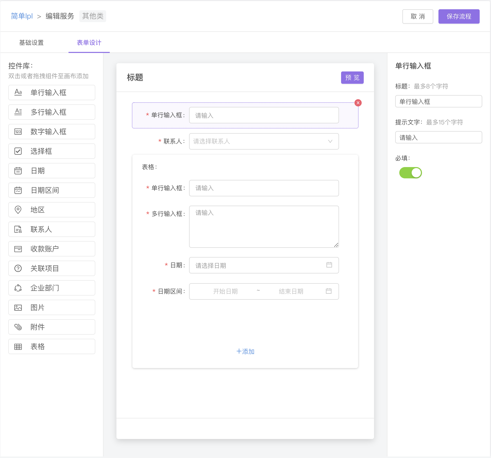
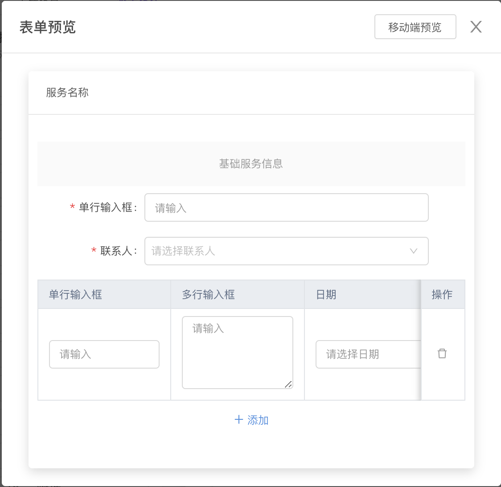

# 动态表单

Created: Apr 1, 2021 4:21 PM

# dynamic & configurable & draggable Form Framework

动态：根据后端返回schema进行表单渲染

可配置：用户可修改或自定义一套表单模板(schema)

可拖拽：可视化、低代码拖拽创建表单模板

# 主要技术

React-Dnd

# 实现效果



设计表单



预览表单

# 数据结构

```tsx
/**
* 每一个控件的定义
*/
type IWidgetFormItem = {
  widget: Partial<{
    type: WidgetType;
    widgetName: string; // 本质是id
    editable: boolean;
    removable: boolean;
    notBlank: boolean;
  }> & { [key: string]: any };
  tip: string;
  tip2?: string;
  label: string;
}

/** 表单值，通过widgetName与控件一一对应 */
type FormValuesVO = {
  [key: string]: {
    data: any;
    detail?: any;
  };
}

/** 控件类型 */
enum WidgetType {
  text                      = "text",
  textarea                  = "textarea",
  number                    = "number",
  dateTime                  = "datetime",                      // 日期和时间
  dateTimeRange             = "daterange",                     // 上面的范围选择
  selectBox                 = "selectbox",                     // 单/多选
  address                   = "address",                       // 地址
  image                     = "image",                         // 图片上传
  upload                    = "upload",                        // 附件上传
  role                      = "role",                          // 联系人，选人组件
  affair                    = "affair",                        // 部门，选事务组件
  projectRelated            = "target",                        // 关联项目
  serviceRelated            = "process",                       // 关联服务
  bankAccount               = "account",
  ocr                       = "ocr",                           // ocr组件 
  subForm                   = "subform",                       // 表格子组件
  empty                     = "empty",                         // 占位
  location                  = "location",                      // 位置
  sign                      = "sign",                          // 签署组件
  serviceProviderEnterprise = "service_provider_enterprise",   // 服务提供企业
}
```

# 实现思路

主要有两个难点：拖拽交互和控件的多态性

## 拖拽交互

用户在设计表单时，界面左侧为控件库，中间为表单设计实时预览（设计盘）。用户可以从控件库拖拽某个控件到设计盘中，即可生成对应的控件实时预览；同时，设计盘中的控件也可以拖拽改变顺序。这两个交互可称为生成和重排序。

拖拽交互的实现基于React-Dnd@5.0.0，关于React-Dnd可看[官方文档](https://react-dnd.github.io/react-dnd/docs/overview)，它的思想主要是以`plain object`作为`Item`，即拖拽对象的信息化数据。

`DragSource`这个HOC用来赋予组件拖拽的能力，`DropTarget` 赋予组件可以接受可拖拽对象的能力（放置）。在beginDrag方法里，以`IWidgetFormItem`这个数据结构作为`Item`，在拖拽交互的处理中能很好地针对不同控件作处理。

```tsx
const DndWidgetItem = DropTarget(
  DndType.Widget,
  {
    drop: (props: DndWidgetItemProps, monitor) => {},
    canDrop: (props: DndWidgetItemProps, monitor) => {}
  },
  (connect, monitor) => ({})
)(DragSource(
  DndType.Widget,
  {
    beginDrag: (props: DndWidgetItemProps, monitor) => {
      return {
	        ...(props.item ?? {}), // 以IWidgetFormItem这个数据结构作为Item
      };
    },
    endDrag: (props: DndWidgetItemProps, monitor) => {},
    canDrag: (props) => {}
  },
  (connect, monitor) => ({})
)(Component))
```

对于控件库中的元素，是 `DraggableWidgetTemplateItem`实现的，只使用了`DragSource`。

对于设计盘中的元素，是`DndWidgetItem`实现的，使用了`DragSource`和`DropTarget`，令其同时可拖拽和放置，同时也使得拖拽交互逻辑内聚。

为了实现设计盘为空时，可从控件库拖入控件，在**设计盘上保留了一个`Empty`控件，作为占位使用**。

控件拖拽时的样式变化，是通过`collect`函数返回的诸如hovering等表示控件拖拽状态的属性，结合CSS实现的。

## 控件的多态性

控件多态性指：控件可以有很多类型、每个控件有不同的meta属性配置、每种meta属性有不同的约束、每种meta属性有不同的表现UI、每个控件有不同的UI表现、相同的组件在设计时和产品时可以有不同的表现

### 控件可以有很多类型

控件类型统一使用`WidgetType`这个枚举定义

### 每个控件有不同的meta属性配置、每种meta属性有不同的约束

text控件的meta属性有label（标签），tip（占位文字），notBlank（必填与否）；而对于number控件，它又多了一个unit（单位）属性。

对于label属性来说，它需要什么默认值，它的最大长度是什么等，这些也需要有不同的配置。

`WidgetMetaConfig.tsx`文件集中配置了这些关系。

```tsx
/** 控件元信息配置项 */
export type IWidgetMetaConfigItem = {
  key: WidgetType;
  label: string;  // 显示为什么名字
  icon: React.ReactNode;  // 用什么图标表示
  attributes: string[]; // 有什么属性，作为field字段 
  attributeConfig: {
    [key: string]: {
      name: string; // 属性显示文字
      defaultValue?: any;  // 属性默认值
      hint?: string;  // 属性提示文字
      rules?: ValidationRule[];  // 属性检验
    }
  };
}
// 以role控件举例
[WidgetType.role]: {
    key: WidgetType.role,
    label: "联系人",
    icon: WidgetIconMap[WidgetType.role],
    attributes: [
      WidgetMetaAttributeType.common.label,
      WidgetMetaAttributeType.common.tip,
      WidgetMetaAttributeType.role.radio,
      WidgetMetaAttributeType.role.range,
      WidgetMetaAttributeType.common.required,
    ],
    attributeConfig: {
      [WidgetMetaAttributeType.common.label]: {
        ...defaultAttributeConfig.common[WidgetMetaAttributeType.common.label],
        defaultValue: "联系人",
      },
      [WidgetMetaAttributeType.role.range]: {
        name: "选择范围",
        hint: "必须选择一项",
        defaultValue: [0],
        rules: [{
          validator: (_, value, cb) => {
            if (!value?.length) {
              cb("必须选择一项");
            }
            cb();
          }
        }]
      },
    },
```

### 每个控件有不同的UI表现、相同的组件在设计时和产品时可以有不同的表现

`WidgetTypeConfig.tsx`文件集中配置了控件对应的UI表现，除了能与ant-design的组件一一对应的，还需要编写特殊业务组件如role控件，account控件。

某些组件由于业务耦合，会调用接口或者需要前置条件，所以在设计时（用户设计表单的实时预览）与产品时（用户真正申请服务时填写表单）可以为其配置不同的UI实现。如account控件、role控件在设计时都是用Select表现，而在产品时分别是定制的业务组件。

```tsx
export type IWidgetTypeConfig = {
  [key: string]: {
    component: React.ComponentType<any>, // 对应的组件
    mapProps?: (value: IWidgetFormItem) => any; // 将后端value对象转换成组件的props
  }
}
/**
 * 对应控件类型使用相应组件进行展示
 * for 设计时
 */
export const WidgetTypeDesignerConfig: IWidgetTypeConfig = {
	[WidgetType.role]: {
    ...SelectLikeWidgetConfigForDesigner
  }
	...
}
/**
 * 对应控件类型使用相应组件进行展示
 * for 使用时
 */
export const WidgetTypeProductionConfig: IWidgetTypeConfig = {
	[WidgetType.role]: {
    component: SelectRole,
    mapProps: value => ({
      mode: value.widget[WidgetMetaAttributeType.role.radio] ? "single" : "multi",
      placeholder: value.tip,
      tabs: (value.widget[WidgetMetaAttributeType.role.range] ?? []).map(
        value => RoleRangeConfigs.find(cof => cof.value === value)?.tab
      ).filter(Boolean),
    } as SelectRoleProps)
  }
	...
}
```

### 每种meta属性有不同的表现UI

在用户设计表单时，用户可以在设计盘中选中某一控件，之后便可以在右侧对控件进行meta属性的修改。与控件相似，meta属性的修改本身也需要UI组件的表现，例如label这个meta属性可以用文本输入框来表现。对meta属性的UI表现的配置集中在`MetaSettingFormConfig.tsx`文件中。

`MetaSettingFormConfig`使用`WidgetType`进行划分，`common`代表该分类下的meta属性对于所有控件的配置是一样的，而不同`WidgetType`下可以对meta属性进行增量配置或者override common的配置。

```tsx
type IConfigItem = {
  component: React.ComponentType<any>;
  defaultProps?: any;
  /** 
   * 组件的值的属性，用于Form.getFieldDecorator，如 Checkbox 的是 'checked' 
   * */
  valuePropName?: string;
  getValueFromEvent?: (e: any) => any;
}
const MetaSettingFormConfig: {
  [key: string]: {
    [key: string]: IConfigItem;
  }
} = {
  common: {
    [WidgetMetaAttributeType.common.required]: {
      component: Switch,
      valuePropName: "checked",
      getValueFromEvent: e => e.target.checked,
    },
		...
  },
	...
}
```

# 总结

动态表单这个需求两个难点分别为：拖拽交互 和 控件多态性。

对于拖拽交互，主要逻辑在于如何判断不同情景下控件的是否可拖拽、拖拽过程中控件的反馈、拖拽后控件的生成和重排以及是否可放置。

对于控件多态性，主要工作在于如何确保多态性的配置是可拓展的，代码是后续可维护的，并且对于其他需求是可复用的。